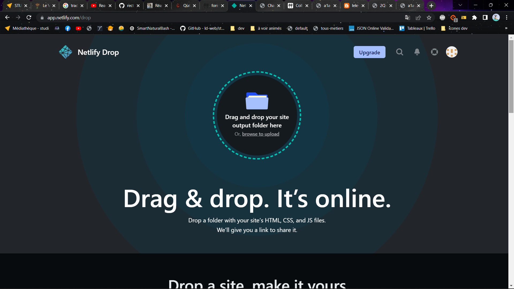
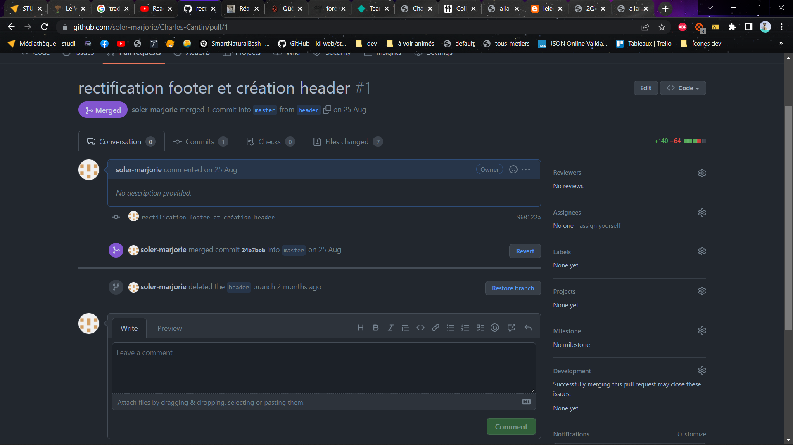
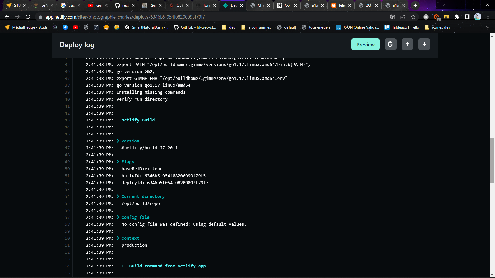

# Charles-Cantin

## **Démarche à suivre pour le déploiement en local ou ligne.**

Ce site est déployer grâce à netlify. Le contenu est modifiable à l'aide du cms Forestry.io.

### **Déploiement local avec Netlify.**

Afin de déployer le site localement, Netlify met en place un système de glisser/déposer.

Il suffira donc de glisser le dossier projet vers Netlify et il se déploiera automatiquement.

### **Déploiement en ligne avec Netlify.**

Pour déployer le site en ligne, un dépot sur github est nécessaire. Il faut pour cela, créer un repository sur son compte git et le lié au projet actuel à travers le terminal grâce au instructions de git.

Pour un bon fonctionnement, il faut que l'adresse mail soit identique sur le compte github et dans le terminal de VSC.

Suite à cela, on peut enregistrer notre code en ligne sur github et créer des branchs puis les merge afin de les intégrer à la branche principale. 

Quand le code est terminé, on peut mettre en ligne le site grâce à netlify qui est un hebergeur de site que du coté front-end. pour cela on clique sur ajouter un site et immporter un nouveau projet avec git.

Netlify va ensuite build le projet afin de le déployer en ligne.

Si aucune erreur est à déplorer par Netlify le site est en ligne !